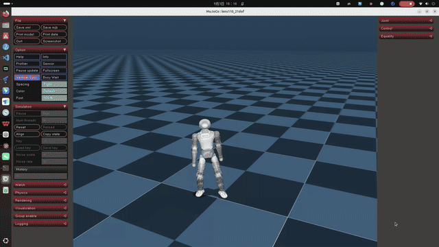
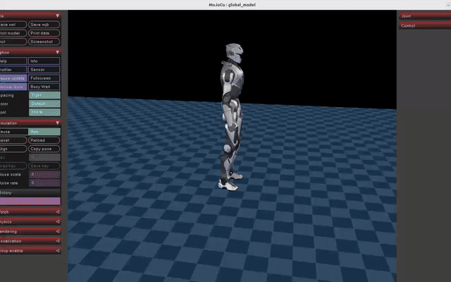

# 双足人形机器人训练与部署共享框架

  <a href='#zh'>中文</a>
  &nbsp;&nbsp;|&nbsp;&nbsp;
  <a href='#en'>English</a>

## 中文

这是一个面向双足人形机器人动作重定向、模仿学习、盲行走、楼梯行走、跌倒起身、侧滚、MuJoCo sim2sim 和 ROS2 真机部署的完整工作区。每个任务项目都有独立的代码、数据、导出包和说明，共享框架与数据通过固定 commit 的子模块连接。

## 项目导航

| 任务 | Public 仓库 | 框架 | 接口 |
|---|---|---|---|
| 跳舞全身 | [dance-whole-body-deepmimic](https://github.com/tulay-hub/dance-whole-body-deepmimic) | DeepMimic | 161 -> 21 |
| 跳舞半身 | [dance-half-body](https://github.com/tulay-hub/dance-half-body) | AMP + upper/lower ankle IO | 21 DoF |
| 行走 | [walk-dwaq-ppo-beta-vae](https://github.com/tulay-hub/walk-dwaq-ppo-beta-vae) | DWAQ + PPO + beta-VAE | 76 / 380 -> 21 |
| 跌倒起身 | [fall-to-stand-amp-getup](https://github.com/tulay-hub/fall-to-stand-amp-getup) | AMP GetUp | 288 -> 21 |
| 翻滚 | [side-roll-deepmimic](https://github.com/tulay-hub/side-roll-deepmimic) | DeepMimic SideRoll | 159 -> 21 |
| 上台阶 | [stairs-dwaq-ppo-beta-vae](https://github.com/tulay-hub/stairs-dwaq-ppo-beta-vae) | DWAQ + stair curriculum | 21 actions |
| 共享框架 | [isaaclab-shared-dwaq-deepmimic](https://github.com/tulay-hub/isaaclab-shared-dwaq-deepmimic) | Isaac Lab + DWAQ + DeepMimic | task and MuJoCo base |
| GMR 重定向 | [gmr-retargeting](https://github.com/tulay-hub/gmr-retargeting) | GMR + BVH + robot IK | human -> robot |
| Robot 重定向 | [robot-retargeter-smplx](https://github.com/tulay-hub/robot-retargeter-smplx) | SMPL-X + URDF/MJCF | body -> robot |
| 舞蹈数据 | [dance-dataset](https://github.com/tulay-hub/dance-dataset) | BVH dataset | raw motion |
| G1 数据说明 | [g1-motion-dataset](https://github.com/tulay-hub/g1-motion-dataset) | documentation | 当前不发布 G1 CSV |

## 通用平衡演示

本 README 已直接包含共享训练架构、六个训练项目的算法和接口说明。以下 GIF 是通用平衡/部署演示，不代表某一个训练任务的 actor 观测契约；完整视频文件也保留在 `docs/media/`。

[打开或下载原始自平衡视频](docs/media/self-balance-demo.webm)

[打开或下载原始重载自平衡视频](docs/media/heavy-load-self-balance-demo.mp4)

## 总体实现架构

~~~mermaid
flowchart LR
    A[Raw BVH CSV PKL NPZ] --> B[GMR or robot retargeter]
    B --> C[Coordinate quaternion joint order contact QA]
    C --> D[Project data and reference motion]
    D --> E[DeepMimic reference tracking]
    D --> F[AMP motion prior]
    D --> G[DWAQ PPO beta-VAE]
    E --> H[Training checkpoint]
    F --> H
    G --> H
    H --> I[TorchScript ONNX export]
    I --> J[Interface checksum parity QA]
    J --> K[MuJoCo sim2sim]
    K --> L[deploy config and joint mapping]
    L --> M[ROS2 infer_zero rl_controller]
    M --> N[Low-risk real robot test]
~~~

训练、导出、MuJoCo 回放和真机动作是不同阶段。只有 observation/action、joint order、四元数、PD、effort、传感器和接触语义全部一致时，策略才能进入下一阶段；MuJoCo 成功不等于真机验证通过。

## 目录和依赖

~~~text
projects/01_dance_whole_body/
projects/02_dance_half_body/
projects/03_walk/
projects/04_fall_to_stand/
projects/05_side_roll/
projects/06_stairs/
frameworks/shared/
tools/retargeting/gmr_lens110/
tools/retargeting/robot_retargeter/
datasets/dance/
deployment/
docs/
~~~

~~~bash
conda activate gmr
conda activate mjlab
conda activate isaaclab
git clone --recurse-submodules https://github.com/tulay-hub/walk-dwaq-ppo-beta-vae.git
cd walk-dwaq-ppo-beta-vae
git lfs install
git lfs pull
~~~

<code>gmr</code> 用于动作重定向，<code>mjlab</code> 用于 MuJoCo 和策略回放，<code>isaaclab</code> 用于 Isaac Lab 训练。真机侧需要 ROS 2 Humble 和机器人本地 install/setup.bash。

## 从数据到真机

~~~text
BVH / SMPL-X / robot CSV
  -> GMR or robot_retargeter
  -> target URDF/MJCF
  -> PKL / CSV / NPY / NPZ
  -> FPS, frame, quaternion, joint order, limit and contact QA
  -> project training data
  -> DeepMimic, AMP or DWAQ training
  -> checkpoint
  -> TorchScript or ONNX
  -> interface and checksum validation
  -> MuJoCo sim2sim
  -> ROS2 deployment
  -> low-risk real robot testing
~~~

示例动作转换：

~~~bash
conda activate gmr
python tools/retargeting/gmr_lens110/lens110/convert_bvh_to_lens110.py --bvh datasets/dance/raw_bvh/original_bvh/tangbohushuoDJ.bvh --out_dir /tmp/lens110_tangbohushuoDJ --method hybrid --retarget_fps 120 --csv_fps 50
~~~

GMR 和 deployment CSV 的根四元数为 <code>xyzw</code>；MuJoCo 根 <code>qpos</code> 为 <code>wxyz</code>。PKL、NPZ、CSV 不因为文件名或数组 shape 相似就可以互换。

## 训练框架

| 框架 | 作用 | 算法结构 |
|---|---|---|
| DeepMimic | 参考动作跟踪、动作平滑 | PPO + reference tracking |
| AMP | 动作先验、任务目标 | PPO + discriminator/LSGAN |
| DWAQ | 无视觉本体感觉盲行 | PPO + beta-VAE context + velocity supervision |
| AMP GetUp | 倒地恢复到稳定站立 | AMP actor/critic + discriminator |

~~~bash
./projects/01_dance_whole_body/scripts/train.sh --headless --num_envs 1024
./projects/02_dance_half_body/scripts/train.sh --headless --num_envs 2048
./projects/03_walk/scripts/train.sh --headless --num_envs 4096
./projects/04_fall_to_stand/scripts/train.sh --env.scene.num-envs=2048
./projects/05_side_roll/scripts/train.sh --headless --num_envs 4096
./projects/06_stairs/scripts/train.sh --headless --num_envs 4096
~~~

长训练前先做前台构造和短时 smoke test；任务 ID、motion set、checkpoint、机器人模型和 deploy config 必须属于同一接口变体。

## Observation 和 action

| 项目 | 观测组成 | 动作 |
|---|---|---|
| 全身舞蹈 H | root rotation 6、angular velocity 3、joint position 21、joint velocity 21、future root 24、future joint 84、foot contact 2 | 21 |
| 半身 upper/lower | 基础 policy group，踝位置/速度使用 upper/lower 语义 | 21 |
| DWAQ 行走 | angular velocity、projected gravity、velocity command、relative joint position/velocity、last action、gait phase | 21 |
| DWAQ history | 5 帧历史；导出 obs [1,76]、obs_history [1,380] | beta-VAE context |
| AMP GetUp | 4 帧 time-major，每帧 72，合计 288 | 21 |
| SideRoll | 6 + 3 + 21 + 21 + 24 + 84 = 159 | 21 |

全身 H 版：<code>6 + 3 + 21 + 21 + 24 + 84 + 2 = 161</code>。SideRoll：<code>159</code>。GetUp：<code>4 x 72 = 288</code>。DWAQ actor 不直接接收 base linear velocity；privileged critic 额外使用 base velocity、脚接触/位置/速度/力和 root height。

半身踝动作链：

~~~text
policy upper/lower target
  -> polynomial / weighted MLP / XML tendon solver
  -> physical pitch/roll target or torque
  -> MuJoCo ankle plant / real actuator mapping
~~~

## Reward 函数

~~~text
R_env(t) = sum_i weight_i * r_i(t)
r_track = exp(-||error||^2 / std^2)
~~~

终止条件不是正向奖励，但会通过 episode truncation、termination penalty、AMP mask 和 curriculum 改变训练信号。AMP discriminator reward、DWAQ beta-VAE 的 velocity/reconstruction/KL loss 属于算法层目标。

| 任务 | 主要奖励 |
|---|---|
| DeepMimic 全身 | root/key-body/joint reference tracking；alive +0.20；joint tracking +0.80/+0.10；torque、acceleration、scaled action-rate 为负向正则 |
| AMP 半身 | velocity +1.25/+1.25；feet air-time +0.60；feet slide -0.12；feet/knee distance +0.15/+0.10；对称、限位、接触和 AMP style reward |
| DWAQ 行走 | velocity +2.5/+3.0；body stability；energy；smoothness；foot safety；termination -200；alive +0.15；idle -2.0；gait reference +0.5/+0.2 |
| AMP GetUp | zero velocity +1/+1；root height +5；upright +2；stand foot slip -2；over-height air -20；gated flat sole +0.6；termination -200 |
| SideRoll | 159-D 基础跟踪；允许滚地接触；height minimum 0.02m；deviation 0.8m；alive 0.05；standing-still -2.0 |
| Stairs | 复用 DWAQ reward，增加 terrain row 0、约 5..30cm 楼梯路径、连续成功升阶和失败降阶 |

完整奖励项、权重、代码路径见 [docs/REWARD_FRAMEWORKS.md](docs/REWARD_FRAMEWORKS.md)。

## 导出、MuJoCo 和真机部署

~~~bash
cd frameworks/shared/lens110_isaaclab/lens110/legged_lab_lbot
python scripts/export_dwaq_onnx_urdf.py --checkpoint logs/rsl_rl/lens110_dwaq/run/model_36700.pt --output policy_dwaq_urdf.onnx
MUJOCO_GL=egl python scripts/play_dwaq_mujoco.py --checkpoint logs/rsl_rl/lens110_dwaq/run/model_36700.pt --xml local-lens110-21dof.xml --terrain flat --demo --demo-duration 60
~~~

部署链：

~~~text
checkpoint
  -> policy.pt / policy.onnx
  -> deploy_config.yaml
  -> joint order / sign / ankle mapping
  -> MuJoCo sim2sim
  -> local ROS2 install/setup.bash
  -> sensor + rl_controller + control nodes
  -> zero pose and emergency-stop test
  -> low-speed low-amplitude test
  -> complete motion test
~~~

GetUp v2 的部署真值为 <code>projects/04_fall_to_stand/exports/versions/Lens110_GetUp_Sim2Real_v2_20260908/config/deploy_config.yaml</code>，定义 500Hz physics、100Hz policy、decimation 5、288 维四帧 observation、21 个 MJCF 顺序动作、action scale、PD、effort 和 SDK joint mapping。

~~~bash
export ROS_SETUP=/opt/ros/humble/setup.bash
export ROBOT_DIR=/opt/infer_zero
export INFER_ZERO_INSTALL_SETUP=/opt/infer_zero/install/setup.bash
export RL_CONTROLLER_BIN=/opt/infer_zero/install/rl_controller/lib/rl_controller/rl_controller
bash deployment/infer_zero/infer_zero/scripts/infer_zero.sh
~~~

真机运行前必须确认急停、通信、关节零位、站高、动作幅度、力矩/速度限制和控制模式。部署命令描述流程，不自动授权机器人运动。

## 复现检查

~~~text
[ ] task ID and checkpoint match
[ ] policy input/output dimensions are probed
[ ] joint order, signs, quaternion convention are verified
[ ] XML/URDF/meshes are local or declared submodules
[ ] action scale, PD, effort and velocity limits match
[ ] ONNX and TorchScript outputs agree
[ ] fixed-duration MuJoCo replay is complete
[ ] deploy config, checksum and replay evidence are recorded
[ ] ROS2 install/setup.bash comes from a local robot build
[ ] emergency-stop and low-risk tests are complete
~~~

- [接口契约](docs/INTERFACE_CONTRACTS.md)
- [奖励框架](docs/REWARD_FRAMEWORKS.md)
- [验证状态](docs/VERIFICATION_STATUS.md)
- [GitHub 发布清单](docs/GITHUB_RELEASE_CHECKLIST.md)

## English

This workspace provides an end-to-end organization for bipedal humanoid robot motion retargeting, imitation learning, blind locomotion, stair locomotion, fall recovery, side rolling, MuJoCo sim2sim, and ROS2 real-robot deployment. Each task repository owns its code, data, exports, scripts, and bilingual documentation. Shared dependencies are pinned with submodules.

## Project map

| Task | Repository | Framework | Interface |
|---|---|---|---|
| Whole-body dance | [dance-whole-body-deepmimic](https://github.com/tulay-hub/dance-whole-body-deepmimic) | DeepMimic | 161 -> 21 |
| Half-body dance | [dance-half-body](https://github.com/tulay-hub/dance-half-body) | AMP + upper/lower ankle IO | 21 DoF |
| Walking | [walk-dwaq-ppo-beta-vae](https://github.com/tulay-hub/walk-dwaq-ppo-beta-vae) | DWAQ + PPO + beta-VAE | 76 / 380 -> 21 |
| Fall-to-stand | [fall-to-stand-amp-getup](https://github.com/tulay-hub/fall-to-stand-amp-getup) | AMP GetUp | 288 -> 21 |
| Side roll | [side-roll-deepmimic](https://github.com/tulay-hub/side-roll-deepmimic) | DeepMimic SideRoll | 159 -> 21 |
| Stairs | [stairs-dwaq-ppo-beta-vae](https://github.com/tulay-hub/stairs-dwaq-ppo-beta-vae) | DWAQ + stair curriculum | 21 actions |
| Shared framework | [isaaclab-shared-dwaq-deepmimic](https://github.com/tulay-hub/isaaclab-shared-dwaq-deepmimic) | Isaac Lab + DWAQ + DeepMimic | task and MuJoCo base |
| GMR retargeting | [gmr-retargeting](https://github.com/tulay-hub/gmr-retargeting) | GMR + BVH + robot IK | human -> robot |
| Robot retargeting | [robot-retargeter-smplx](https://github.com/tulay-hub/robot-retargeter-smplx) | SMPL-X + URDF/MJCF | body -> robot |
| Dance dataset | [dance-dataset](https://github.com/tulay-hub/dance-dataset) | BVH dataset | raw motion |
| G1 data documentation | [g1-motion-dataset](https://github.com/tulay-hub/g1-motion-dataset) | dataset documentation | original G1 CSV is not published |

## End-to-end workflow

~~~text
BVH / SMPL-X / robot CSV
  -> GMR or robot_retargeter
  -> target URDF/MJCF
  -> PKL / CSV / NPY / NPZ
  -> coordinate, quaternion, joint-order, FPS, contact and limit QA
  -> DeepMimic, AMP, or DWAQ training
  -> full checkpoint
  -> TorchScript or ONNX export
  -> interface and checksum validation
  -> MuJoCo sim2sim
  -> ROS2 deployment
  -> safety-gated real-robot testing
~~~

DeepMimic performs reference-motion tracking. AMP combines task rewards with a discriminator motion prior. DWAQ is a blind proprioceptive PPO system with a beta-VAE history context and velocity supervision. AMP GetUp uses a four-frame state history.

## Observation and action contracts

- Whole-body H: 161 observations and 21 actions.
- Half-body: 21 actions with upper/lower ankle semantics.
- DWAQ: exported obs [1,76], history [1,380], action [1,21].
- AMP GetUp: four frames of 72 features, 288 input features, 21 actions.
- SideRoll: 159 observations and 21 actions.
- GMR/deployment root quaternion is xyzw; MuJoCo root qpos is wxyz.

The DWAQ actor uses angular velocity, projected gravity, command, relative joint position/velocity, last action, and gait phase. Its privileged critic additionally uses base velocity, foot contact/pose/force, and root height.

## Reward design

The environment reward is <code>R_env(t) = sum_i weight_i * r_i(t)</code>, with common tracking form <code>r_track = exp(-||error||^2 / std^2)</code>. DeepMimic uses reference tracking and smoothness; AMP adds a discriminator motion prior; DWAQ adds velocity, foot safety, gait, alive and termination terms plus beta-VAE velocity/reconstruction/KL objectives; GetUp emphasizes height and upright recovery; SideRoll permits legal rolling contact; Stairs adds success-gated terrain promotion and demotion.

## Environment, MuJoCo and hardware

~~~bash
conda activate gmr
conda activate mjlab
conda activate isaaclab
git clone --recurse-submodules https://github.com/tulay-hub/walk-dwaq-ppo-beta-vae.git
cd walk-dwaq-ppo-beta-vae
git lfs install
git lfs pull
~~~

GetUp deployment defines 500Hz physics, 100Hz policy, decimation 5, a 288-dimensional four-frame observation, 21 MJCF-order actions, action scaling, PD/effort limits, and SDK joint mapping.

~~~bash
export ROS_SETUP=/opt/ros/humble/setup.bash
export ROBOT_DIR=/opt/infer_zero
export INFER_ZERO_INSTALL_SETUP=/opt/infer_zero/install/setup.bash
export RL_CONTROLLER_BIN=/opt/infer_zero/install/rl_controller/lib/rl_controller/rl_controller
bash deployment/infer_zero/infer_zero/scripts/infer_zero.sh
~~~

The deployment template loads ROS2 and the local install space and starts sensor, controller, joystick, and control-message nodes. Verify emergency stop, communications, joint zero, standing height, motion amplitude, torque and velocity limits, and control mode before allowing motion.

## Reproduction checklist

~~~text
[ ] task and checkpoint match
[ ] policy dimensions are probed
[ ] joint order, signs and quaternion convention are verified
[ ] XML, URDF and meshes are local or declared submodules
[ ] action scale, PD, effort and velocity limits match
[ ] ONNX and TorchScript outputs agree
[ ] fixed-duration MuJoCo replay is complete
[ ] deploy config, checksum and replay evidence are recorded
[ ] ROS2 install/setup.bash comes from a local robot build
[ ] emergency-stop and low-risk tests are complete
~~~

- [Interface contracts](docs/INTERFACE_CONTRACTS.md)
- [Reward frameworks](docs/REWARD_FRAMEWORKS.md)
- [Verification status](docs/VERIFICATION_STATUS.md)
- [GitHub release checklist](docs/GITHUB_RELEASE_CHECKLIST.md)
