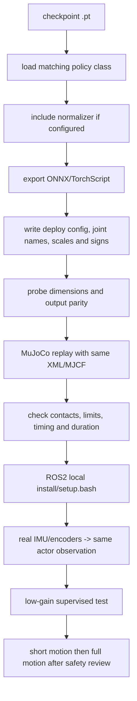

<p align='center'><a href='#zh'>中文</a> | <a href='#en'>English</a></p>
<a id='zh'></a>

# 双足人形机器人训练与部署共享框架

## 训练权重如何理解 / Interpreting training weights

本文按本仓库当前代码说明训练机制；已有策略的复现参数以对应 run 的 `params/env.yaml`、`params/agent.yaml` 和部署配置为准。奖励混合系数、逐项环境奖励权重、优化器 loss 系数、专家样本比例以及课程采样范围是不同概念。

混合系数可以写成 85%/15% 这样的配置比例，但不能代表训练过程中实际累计奖励贡献；单项 reward 的数值范围、门控、控制步长和出现频率都不同。需要实际贡献占比时，应统计同一 run 中每项加权回报，而不是把配置权重归一化成百分比。

Configuration mixing coefficients are not measured reward contributions. Environment weights, optimizer coefficients, expert sampling and curriculum schedules describe different parts of training. Reproduce a saved policy with its own run snapshots.

## 实际训练机制与权重 / Implemented training mechanisms

| 项目 | 实际方法 | 配比与阶段 |
|---|---|---|
| 全身舞蹈 | DeepMimic 参考动作指导 + RSI + PPO 残差控制 | 七项跟踪权重合计 1.75；PPO value/entropy=1/0.005；当前无硬 action clip |
| 半身 upper/lower | 专家动作 AMP（LSGAN）+ PPOAMP + 踝部映射 | task/style=0.4/0.6；style=0.02×5×phi；200/50 Hz；判别器 3 帧 |
| 行走 | DWAQ PPO + 历史 Context β-VAE | RL value/entropy=1/0.008；VAE velocity/reconstruction/KL 系数=1/1/1 |
| 跌倒起身 | AMP + 专家动作指导 + 倒放式课程（PPO） | task/AMP=0.85/0.15；AMP=0.1×phi；当前出生高度下界 0.16→0.16 m |
| 侧滚 | 159-D DeepMimic + RSI + PPO 参考中心残差 | 与全身同残差公式；alive=0.05、静止段=-2；合法滚地终止门 |
| 盲走上楼梯 | DWAQ PPO + β-VAE + 成功门控地形课程 | 复用行走权重；连续两次达到时间/净位移条件才升阶 |

起身的专家指导包含专家状态转移对判别器的指导，以及专家帧初始化；倒放式课程是由容易的起身末段向更低的出生姿态扩展，并非倒序播放动作。当前源码和 v2/model_72500 的快照都为 `z_from=z_to=0.16`，采用课程完全放开的采样范围。恢复环境比例为 1.0，窗口为 300 策略步；这些不是奖励百分比。

English: GetUp combines AMP, expert-transition/state guidance and backward-chaining reset curriculum under PPO. Its reward blend is 0.85 task + 0.15 AMP, with AMP scaled by 0.1. Current source and the v2 checkpoint use start=end=0.16 m, meaning a fully expanded reset range. Upper/lower AMP instead uses 0.4 task + 0.6 style with style=0.02×5×phi and 200/50 Hz simulation/control. DWAQ optimizes PPO and VAE separately; its VAE coefficients are 1:1:1, not percentage contributions.

## 1. 文档范围

本仓库是六个双足人形机器人训练项目共用的 Isaac Lab/LeggedLab、RSL-RL、机器人资产、MuJoCo 回放和导出底座。它不把不同任务合并成一个 checkpoint；每个任务仍有独立的 observation/action contract、motion set、reward、experiment 和 export package。

| 训练项目 | 算法 | 输入/输出契约 |
|---|---|---|
| 全身舞蹈 | DeepMimic + PPO | `161 -> 21` |
| 半身舞蹈 | AMP + PPO + LSGAN + upper/lower IO | `72 -> 21` |
| 行走 | DWAQ + PPO + β-VAE | `76 + 380 -> 21` |
| 跌倒起身 | AMP + 专家指导 + 倒放式课程 + PPO | `288 -> 21` |
| 翻滚 | DeepMimic + PPO | `159 -> 21` |
| 上台阶 | DWAQ + PPO + β-VAE + stair curriculum | `76 + 380 -> 21` |

相关独立仓库：

- [dance-whole-body-deepmimic](https://github.com/tulay-hub/dance-whole-body-deepmimic)
- [dance-half-body](https://github.com/tulay-hub/dance-half-body)
- [walk-dwaq-ppo-beta-vae](https://github.com/tulay-hub/walk-dwaq-ppo-beta-vae)
- [fall-to-stand-amp-getup](https://github.com/tulay-hub/fall-to-stand-amp-getup)
- [side-roll-deepmimic](https://github.com/tulay-hub/side-roll-deepmimic)
- [stairs-dwaq-ppo-beta-vae](https://github.com/tulay-hub/stairs-dwaq-ppo-beta-vae)

## 2. 总体训练架构

```mermaid
flowchart LR
  A[BVH / SMPL-X / robot CSV] --> B[GMR or robot retargeter]
  B --> C[URDF/MJCF target representation]
  C --> D[CSV PKL NPY NPZ + FPS/order/quaternion QA]
  D --> E[project motion and dataset folder]
  E --> F[DeepMimic reference branch]
  E --> G[AMP discriminator branch]
  E --> H[DWAQ PPO beta-VAE branch]
  F --> I[Isaac Lab / MJLab environment]
  G --> I
  H --> I
  I --> J[observation manager]
  J --> K[action manager and robot plant]
  K --> L[physics/contact]
  L --> M[RewardManager + termination]
  M --> N[RL runner/checkpoint]
  N --> O[PT -> TorchScript/ONNX]
  O --> P[interface parity and checksum QA]
  P --> Q[MuJoCo sim2sim]
  Q --> R[ROS2/infer_zero adapter]
  R --> S[staged hardware validation]
```



训练、PLAY、MuJoCo 和真机不是同一个阶段。进入下一阶段前必须证明任务 ID、checkpoint、机器人模型、关节顺序、四元数、动作缩放、PD/effort、观测归一化和控制频率一致。

## 3. 公共框架组件

| 组件 | 位置/作用 |
|---|---|
| Isaac Lab/LeggedLab | `lens110/legged_lab_lbot` | ManagerBased RL、scene、MDP、terrain、任务注册 |
| DeepMimic | `tasks/locomotion/deepmimic` | 参考动作、未来帧、root/key-body/DOF tracking |
| AMP | `tasks/locomotion/amp` 或独立 `AMP_mjlab` | demo 状态、discriminator、style reward |
| DWAQ | `rsl_rl/rsl_rl/modules/actor_critic_dwaq.py` | actor + context encoder |
| β-VAE | `rsl_rl/rsl_rl/modules/context_vae.py` | 历史编码、velocity code、latent code、reconstruction |
| DWAQPPO | `rsl_rl/rsl_rl/algorithms/dwaq_ppo.py` | PPO 更新与独立 VAE optimizer |
| RSL-RL runner | `rsl_rl/rsl_rl/runners` | rollout、GAE、mini-batch、checkpoint |
| Retargeting | `tools/retargeting/gmr_lens110`、`robot_retargeter` | human/body data -> bipedal humanoid joint motion |
| MuJoCo | `scripts/play_*_mujoco.py`、各 export package | 固定 XML 和时序的 sim2sim replay |
| Deployment | `deployment/infer_zero` | 本地 ROS2 install、sensor、rl_controller 和控制消息边界 |

## 4. 观测和动作总契约

### 4.1 DeepMimic 全身 H

`6 root rotation + 3 root angular velocity + 21 joint position + 21 joint velocity + 24 future root rotation + 84 future joint position + 2 foot contact = 161`。参考 root/joint 未来帧由 animation manager 提供，action 为 21 维 residual，当前语义是 `q_des = q_ref + 0.25 * clipped_action`。

### 4.2 DeepMimic SideRoll

`6 root rotation + 3 body-frame root angular velocity + 21 joint position + 21 joint velocity + 24 future root rotation + 84 future joint position = 159`。它不包含 foot contact 2 维，并使用 `DATASET_TO_POLICY` 把动作数据的 USD 交叉顺序重排为 URDF policy 顺序。

### 4.3 AMP 半身

actor 每帧为 `3 base_ang_vel + 3 projected_gravity + 3 velocity_commands + 21 joint_pos + 21 joint_vel + 21 last_action = 72`。upper/lower variant 只替换踝部位置/速度编码和动作解码，四个 policy-facing slots 为左右 ankle upper/lower。critic、discriminator、demo 分别维护自己的特权/参考输入。

### 4.4 DWAQ 行走/楼梯

actor 为 `3 base_ang_vel + 3 projected_gravity + 3 velocity_commands + 21 joint_pos + 21 joint_vel + 21 last_action + 4 gait_phase = 76`；history 为 5 帧、`380` 维。critic 另有 base linear velocity、足端接触/位置/速度/力和 root height。Context VAE code 为 19 维（velocity 3 + latent 16），导出接口为 `obs [1,76] + obs_history [1,380] -> action [1,21]`。

### 4.5 AMP GetUp

actor 每帧为 `3 base_ang_vel + 3 projected_gravity + 3 zero command + 21 joint_pos_rel + 21 joint_vel_rel + 21 prev_actions = 72`，4 帧 time-major history 为 `288`。AMP 还使用 tracked-body 的位置、姿态、线速度和角速度，不能把这些 discriminator/critic 输入送入硬件 actor。

公共边界：GMR/deployment CSV 根四元数为 `xyzw`；MuJoCo root qpos 为 `wxyz`。任何跨格式转换都必须由显式脚本完成。

## 5. Reward 和算法目标

环境奖励的一般形式为：

```text
R_env(t) = Σ_i weight_i * r_i(t)
r_track(e) = exp(-||e||² / std²)
```

| 任务 | 环境 reward 构成 | 算法层额外目标 |
|---|---|---|
| 全身舞蹈 | root/key-body/DOF reference tracking、alive、torque、acc、scaled action-rate | PPO actor-critic |
| 半身舞蹈 | velocity、姿态、脚步、对称、限位、接触、平滑 | AMP discriminator style reward + PPO |
| DWAQ 行走 | velocity、姿态、energy、acc/action-rate、足端、安全、alive、idle、腿部/相位先验、termination | velocity MSE + reconstruction MSE + `beta*KL` + PPO |
| GetUp | zero velocity、height、upright、站定滑步、脚底、超高、防碰撞、限位 | AMP style reward + PPO |
| SideRoll | 159-D reference tracking、scaled regularization、允许滚地接触、静止段防蹭步 | PPO，无 AMP/β-VAE |
| Stairs | 与 DWAQ 行走相同的环境 reward | DWAQ/VAE/PPO + terrain success curriculum |

AMP 的 discriminator reward、DWAQ 的 VAE loss 和 PPO surrogate/value/entropy 是不同层次的训练信号；日志、复现说明和调参时必须分开列出。完整权重见 `docs/REWARD_FRAMEWORKS.md`。

## 6. 本地依赖和安装边界

```bash
conda activate gmr       # GMR / BVH / retargeting
conda activate mjlab     # MJLab/MuJoCo replay and GetUp
conda activate isaaclab  # Isaac Lab/LeggedLab training
git clone --recurse-submodules https://github.com/tulay-hub/isaaclab-shared-dwaq-deepmimic.git
cd isaaclab-shared-dwaq-deepmimic
git lfs install
git lfs pull
```

训练环境必须使用本机的 Isaac Lab、LeggedLab 和 RSL-RL 依赖；retargeting、训练、MuJoCo 回放和 deployment 的依赖不能靠远程绝对路径。真机侧要求 ROS 2 Humble 与机器人本地 `install/setup.bash`，路径由环境变量指定。

## 7. 导出到真机的完整链路



GetUp v2 `deploy_config.yaml` 记录了 500 Hz physics、100 Hz policy、decimation 5、288 history、MJCF 21 joint order、default pose、action scale、PD、effort、fall detection 和 SDK joint mapping。DWAQ 导出必须同时保留 current obs 与 history 两个输入；DeepMimic/SideRoll 必须保留对应的未来参考帧语义。

## 8. 公共验收清单

- [ ] 使用与任务匹配的本地环境和依赖，路径可在新 checkout 解析。
- [ ] task ID、motion set、机器人模型、checkpoint、export config 成套。
- [ ] 运行时 probe 证明 observation/action 维度和顺序。
- [ ] `xyzw`/`wxyz`、dataset/policy/SDK joint order 已显式核对。
- [ ] ONNX/TorchScript 输出与原始策略在同一输入下相符。
- [ ] MuJoCo 固定时长 replay 通过，mesh/XML/接触无断链。
- [ ] critic privileged、AMP demo、VAE velocity target 没有接到硬件 actor。
- [ ] 真机前有零位、急停、限位、低增益、电流/温度和人工看护方案。

<a id='en'></a>

# Bipedal Humanoid Robot Shared Training and Deployment Framework

## Scope

This repository provides the shared Isaac Lab/LeggedLab, RSL-RL, robot assets, MuJoCo replay, and export base for six independent bipedal humanoid robot training projects. It does not merge their checkpoints. Each task keeps its own observation/action contract, motion set, rewards, experiments, and export package.

| Project | Method | Interface |
|---|---|---|
| Whole-body dance | DeepMimic + PPO | `161 -> 21` |
| Half-body dance | AMP + PPO + LSGAN + upper/lower IO | `72 -> 21` |
| Walking | DWAQ + PPO + beta-VAE | `76 + 380 -> 21` |
| Fall-to-stand | AMP GetUp + PPO | `288 -> 21` |
| Side roll | DeepMimic + PPO | `159 -> 21` |
| Stairs | DWAQ + PPO + beta-VAE + curriculum | `76 + 380 -> 21` |

## Architecture

```mermaid
flowchart LR
  A[raw motion] --> B[retargeting]
  B --> C[format and contract QA]
  C --> D[project motion data]
  D --> E[DeepMimic / AMP / DWAQ training]
  E --> F[checkpoint]
  F --> G[ONNX or TorchScript]
  G --> H[dimension and checksum parity]
  H --> I[MuJoCo sim2sim]
  I --> J[ROS2 hardware adapter]
  J --> K[safety-gated real robot test]
```



DeepMimic is reference tracking. AMP adds a discriminator motion prior. DWAQ adds a history Context beta-VAE and velocity supervision for blind locomotion. GetUp specializes the AMP task for recovery. Stairs reuses DWAQ and changes terrain/curriculum.

## Contracts

Whole-body H is `161 -> 21`; SideRoll is `159 -> 21` without foot-contact input; AMP actor is 72 values per frame; GetUp stacks four 72-value frames into 288; DWAQ stacks five 76-value frames into 380 and exports current observation plus history to 21 actions. GMR/deployment CSV uses `xyzw` root quaternions, while MuJoCo qpos uses `wxyz`.

## Rewards and losses

The environment reward is a weighted sum of task tracking, stability, contact, smoothness, limits, survival, and termination terms. AMP discriminator reward, DWAQ velocity/reconstruction/KL losses, and PPO surrogate/value/entropy losses are algorithm-level signals and must be documented separately. See `docs/REWARD_FRAMEWORKS.md` for exact weights.

## Local dependencies and deployment

Use the local `gmr`, `mjlab`, and `isaaclab` environments. Clone with submodules and fetch LFS files. Train with the task-specific script, export the matching policy and normalizer, replay with the same XML/MJCF, and only then connect ROS2 using the robot's local Humble install space. Hardware must rebuild the same actor observation from real IMU/encoders and must not require critic privileged state, demo state, terrain truth, or VAE velocity targets.
